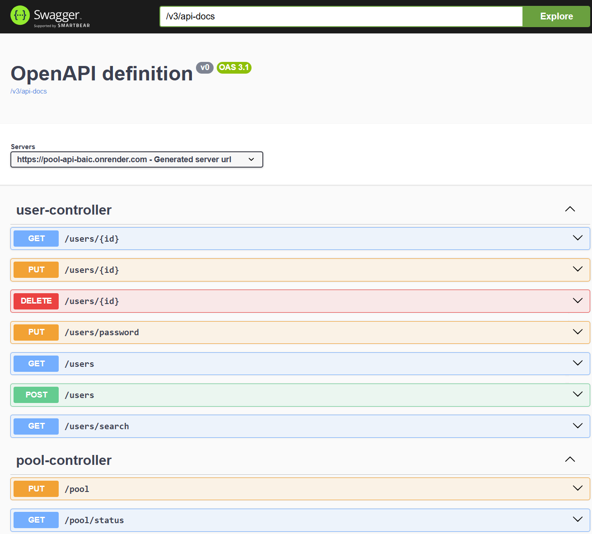

# Pool API

API REST de gestion de piscine développée avec Spring Boot 3.4.3.




🌐 **API en ligne** : [https://pool-api.thomasschmidt.fr](https://pool-api.thomasschmidt.fr)  
📖 **Swagger** : [https://pool-api.thomasschmidt/swagger-ui/index.html](https://pool-api.thomasschmidt.fr/swagger-ui/index.html)

> ⚠️ L'API peut mettre quelques secondes à répondre lors de la première requête (réveil du service Render).

---

## Technologies

- Java 21
- Spring Boot 3.4.3
- Spring Security + JWT
- Spring Data JPA / Hibernate
- PostgreSQL
- Lombok
- JavaFaker (données de test)
- Springdoc OpenAPI (Swagger)
- Docker

---

## Déploiement

L'API est dockerisée et déployée sur Render avec une base PostgreSQL managée.

### Lancement local

1. Cloner le dépôt
2. Créer une base de données PostgreSQL `pool_db`
3. Configurer `application.properties` :

```properties
spring.datasource.url=jdbc:postgresql://localhost:5432/pool_db
spring.datasource.username=YOUR_USERNAME
spring.datasource.password=YOUR_PASSWORD
jwt.secret=YOUR_SECRET
jwt.expiration=86400000
app.seeder.password=YOUR_SEEDER_PASSWORD
```

4. Lancer l'application — les tables et données de test sont créées automatiquement.

---

## Authentification

Toutes les routes (sauf `/auth/login`) nécessitent un token JWT dans le header :

```
Authorization: Bearer <token>
```

Connexion :

```
POST /auth/login
{
    "email": "prenom.nom@mail.com",
    "password": "motdepasse"
}
```

---

## Rôles

| Rôle | Description |
|------|-------------|
| `ROLE_ADMIN` | Accès complet |
| `ROLE_EMPLOYEE` | Gestion des accès et vente de tickets |
| `ROLE_USER` | Accès à ses propres données |

---

## Routes principales

| Méthode | Route | Rôle requis | Description |
|---------|-------|-------------|-------------|
| POST | `/auth/login` | — | Authentification |
| GET | `/pool/status` | ALL | Statut et capacité de la piscine |
| PUT | `/pool` | ADMIN | Modifier la capacité |
| GET | `/users` | ADMIN, EMPLOYEE | Liste des utilisateurs |
| POST | `/users` | ADMIN, EMPLOYEE | Créer un utilisateur |
| GET | `/users/search?q=` | ADMIN, EMPLOYEE | Recherche par nom/prénom |
| GET | `/users/tickets` | ALL | Tickets de l'utilisateur connecté |
| POST | `/users/tickets` | ALL | Acheter un ticket |
| POST | `/users/{id}/tickets` | ADMIN, EMPLOYEE | Vendre un ticket à un utilisateur |
| GET | `/users/subscriptions` | ALL | Abonnements de l'utilisateur connecté |
| POST | `/users/subscriptions` | ALL | Souscrire un abonnement |
| GET | `/tickets/kinds` | ALL | Types de tickets disponibles |
| POST | `/tickets/kinds` | ADMIN | Créer un type de ticket |
| GET | `/subscriptions/kinds` | ALL | Types d'abonnements disponibles |
| POST | `/subscriptions/kinds` | ADMIN | Créer un type d'abonnement |
| GET | `/employees` | ADMIN | Liste des employés |
| POST | `/employees` | ADMIN | Créer un employé |
| POST | `/access/entry` | ALL | Enregistrer une entrée |
| POST | `/access/exit` | ALL | Enregistrer une sortie |
| GET | `/access` | ADMIN, EMPLOYEE | Historique des accès |

---

## Structure du projet

```
pool-api/
├── Dockerfile
├── src/main/java/fr/schmidt/poolapi/
│   ├── config/          ← SecurityConfig, DataSeeder
│   ├── controller/      ← REST controllers
│   ├── dto/             ← Request / Response DTOs
│   ├── model/entity/    ← Entités JPA
│   ├── repository/      ← Spring Data repositories
│   ├── security/        ← JWT filter, JwtService
│   └── service/         ← Logique métier
└── src/main/resources/
    └── application.properties
```
